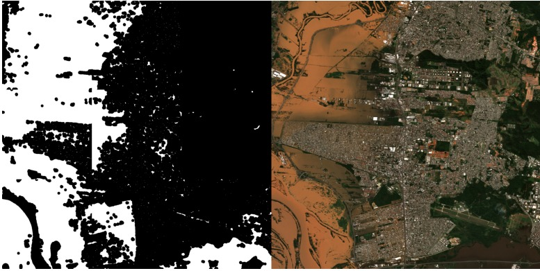

# Open Flood: Open-Source Flooding Impact Assessment Pipeline

## Overview

Open Flood is an open-source tool designed to assess the impact of flooding by using Convolutional Neural Networks (CNNs), public population data, and satellite imagery from Sentinel-1 and Sentinel-2. It was developed as part of our CAPSTONE project at [Insper](https://www.insper.edu.br/en/) in partnership with [NVIDIA](https://www.nvidia.com/en-us/).

Key features include:
- Satellite data collection from Sentinel-1 and Sentinel-2.
- Flood classification after disasters.
- Population impact estimation.
- Modular and intuitive pipeline.

### Open Flood Example Output


## Project Structure

The project is divided into the following components, each with its own dedicated README for setup and usage instructions:

- **[Sentinel Downloader](sentinel-downloader/README.md)**: A Python package and Dockerized tool for satellite image downloading.
- **[Flood Segmentation](flood-segmentation/README.md)**: Module for training and applying the model to segment flooded areas.
- **[Mask Augmentation](mask-aug/README.md)**: Tools for improving flood segmentation model performance.
- **[Statistics](stats/README.md)**: Combined pipeline for analyzing flood impacts, including population estimation.

## Installation and Setup

### Prerequisites
Ensure the following are installed on your system:
- [Docker](https://docs.docker.com/get-started/get-docker/)

### Quick Start Guide
1. Clone the repository:
   ```bash
   git clone https://github.com/JoaoLucasMBC/open-flood.git
   cd open-flood
   ```

2. Follow the individual module instructions for setup:
    - [Sentinel Downloader](sentinel-downloader/README.md)
    - [Flood Segmentation](flood-segmentation/README.md)
    - [Statistics](stats/README.md)

3. Run the pipeline using Docker Compose or as Python packages depending on your preference.

# Contribution Guide
We welcome contributions from the community to enhance Open Flood. Please follow these steps:

1. Fork the repository.
2. Create a feature branch: git checkout -b feature-name.
3. Commit your changes: git commit -m 'feat: Add new feature'.
4. Push to your branch: git push origin feature-name.
5. Submit a pull request for review.

### Group Members
- [Pedro Pertusi](https://github.com/PedroPertusi)
- [Eduardo Vaz](https://github.com/EduardoMVAz)
- [Alexandre Magno](https://github.com/alemagno10)
- [Joao Lucas](https://github.com/JoaoLucasMBC)

### Mentors
- [Igor Montagner](https://github.com/igordsm) - Insper Professor
- [Jomar Silva](https://www.linkedin.com/in/homembit/) - NVIDIA Developer Relations Manager

# License 

This project is licensed under the MIT License - see the [LICENSE](LICENSE) file for details.

# Acknowledgements

- [Sentinel Hub](https://www.sentinel-hub.com/) for providing access to satellite imagery.
- [Earth Engine](https://earthengine.google.com/) for providing access to satellite imagery.
- [WorldPop](https://www.worldpop.org/) for providing population data.
- [Disaster Risk Monitoring Using Satellite Imagery](https://learn.nvidia.com/courses/course-detail?course_id=course-v1:DLI+S-ES-01+V1) NVIDIA course for inspiration.